# 《量化交易》第一次作业

## 1. 数据来源

涉及的主要数据包括：

- 市场指数类：上证50指数、沪深300指数、中证500指数日数据
- 指数ETF类：上证50ETF日数据、上证50ETF 1分钟数据
- 股票类：沪深300成分股日收盘价、沪深300成分股信息
- 期货类：上证50期货、中证500期货、沪深300期货日数据
- 期权类：上证50ETF认购期权、认沽期权 1分钟数据

## 2. 样本选择规则

为了让股票样本既有代表性、又便于比较，股票部分采用了如下简单规则：

1. 在沪深300成分股收盘价表中，优先保留历史完整度高、长期非零价格序列较多的股票；
2. 与成分股信息表按代码匹配后，按权重从高到低排序；
3. 按 Wind 一级行业做简单去重，避免 5 只股票全部集中在单一行业。

最终选出的 5 只股票为：

- 贵州茅台
- 中国平安
- 长江电力
- 中国中免
- 恒瑞医药

其他类别资产样本为：

- 指数：上证50指数、沪深300指数、中证500指数
- ETF：上证50ETF
- 期货：沪深300期货
- 期权：50ETF购9月2450、50ETF沽9月3500

## 3. 研究方法

### 3.1 收益率定义

本文统一使用对数收益率：

\[
r_t = \ln(P_t) - \ln(P_{t-1})
\]

其中 \(P_t\) 表示收盘价。

### 3.2 基本统计量

对每个资产的收益率序列计算：

- 均值
- 中位数
- 标准差
- 偏度
- 峰度
- 最小值
- 最大值
- 一阶自相关系数

### 3.3 进阶分析方法

- 多频率比较：将日频进一步重采样为周频、月频，比较收益率均值和波动率。
- 隔夜/日内收益比较：分别计算 \( \ln(Open_t/Close_{t-1}) \) 与 \( \ln(Close_t/Open_t) \)。
- 上午/下午比较：基于分钟数据，分别统计上午与下午的区间收益。
- 等交易量间距：按累计成交量分桶，构造等成交量价格序列，再比较收益率波动。
- 相关性分析：使用同步收益率序列构造相关系数矩阵。
- 日历效应：按星期与月份分组比较平均收益。
- 日内季节效应：按半小时聚合 1 分钟数据的平均收益。

## 4. 基本统计结果

### 4.1 基本统计量汇总

| 资产 | 均值 | 中位数 | 标准差 | 偏度 | 峰度 | 最小值 | 最大值 | 自相关 | 最高点日期 | 最低点日期 |
| --- | --- | --- | --- | --- | --- | --- | --- | --- | --- | --- |
| 上证50指数 | 0.00022 | 0.000209 | 0.01662 | -0.278566 | 4.160583 | -0.099494 | 0.092334 | 0.005824 | 2007-10-16 | 2005-06-03 |
| 沪深300指数 | 0.000223 | 0.000607 | 0.016271 | -0.407753 | 4.189717 | -0.096952 | 0.089748 | 0.023 | 2007-10-16 | 2005-06-03 |
| 中证500指数 | 0.000423 | 0.001906 | 0.019063 | -0.850803 | 3.59974 | -0.093791 | 0.09415 | 0.065321 | 2015-06-12 | 2005-07-18 |
| 上证50ETF | 0.000337 | 0.0 | 0.016916 | -0.155838 | 5.059817 | -0.105455 | 0.09578 | -0.010648 | 2021-02-10 | 2005-06-03 |
| 沪深300期货 | 0.000054 | -0.000053 | 0.015929 | -0.413121 | 6.986496 | -0.106357 | 0.097371 | -0.003339 | 2021-02-10 | 2014-03-20 |
| 50ETF购9月2450 | -0.008589 | -0.035521 | 0.073874 | 0.813148 | -0.574006 | -0.100389 | 0.15879 | -0.14475 | 2022-08-12 | 2022-08-24 |
| 50ETF沽9月3500 | 0.003732 | 0.011562 | 0.040982 | -0.593662 | -0.371605 | -0.095997 | 0.0722 | -0.132143 | 2022-08-24 | 2022-08-12 |
| 贵州茅台 | 0.000941 | 0.00027 | 0.019648 | 0.015591 | 2.319221 | -0.105361 | 0.09531 | 0.005697 | 2021-02-10 | 2010-06-29 |
| 中国平安 | 0.00024 | 0.0 | 0.019458 | 0.099224 | 3.338493 | -0.105398 | 0.095448 | -0.009553 | 2020-12-01 | 2013-07-29 |
| 长江电力 | 0.00048 | 0.0 | 0.012429 | 0.021523 | 5.886845 | -0.100009 | 0.075223 | -0.068712 | 2022-08-12 | 2011-09-06 |
| 中国中免 | 0.000959 | 0.000334 | 0.026699 | -0.031553 | 2.54445 | -0.105501 | 0.095488 | 0.014973 | 2021-02-10 | 2010-05-20 |
| 恒瑞医药 | 0.000628 | 0.000557 | 0.021153 | -0.072809 | 2.446954 | -0.105361 | 0.095464 | 0.015545 | 2020-12-25 | 2010-07-01 |

### 4.2 基本结论

从上表可以得到几条比较清晰的结论：

1. 股票和指数的日收益率均值整体为正，说明长期样本中价格总体仍呈上涨趋势。
2. 期权收益率波动显著大于现货和指数，说明衍生品对标的价格变化更加敏感。
3. 多数资产的偏度、峰度都偏离正态分布，特别是峰度普遍偏高，说明金融收益率具有典型的“尖峰厚尾”特征。
4. 一阶自相关系数普遍较小，说明日频收益率的线性可预测性不强。

## 5. 图形展示与分析

### 5.1 指数、ETF、期货样本

#### 上证50指数价格图

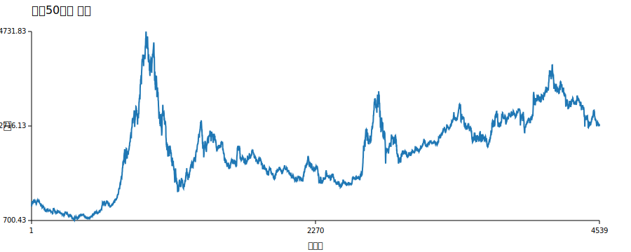

#### 上证50指数收益率直方图

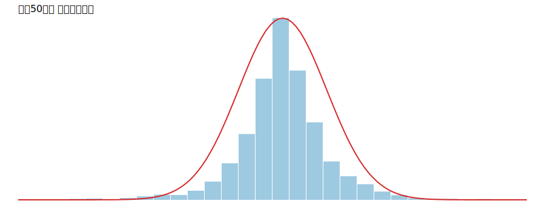

#### 沪深300指数价格图

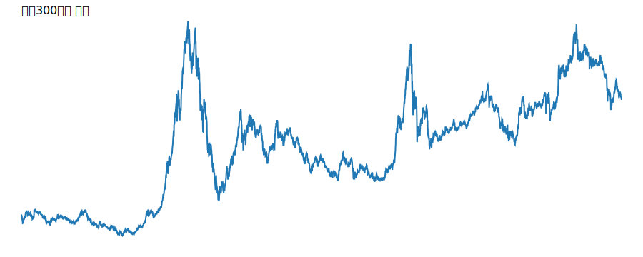

#### 沪深300指数收益率直方图

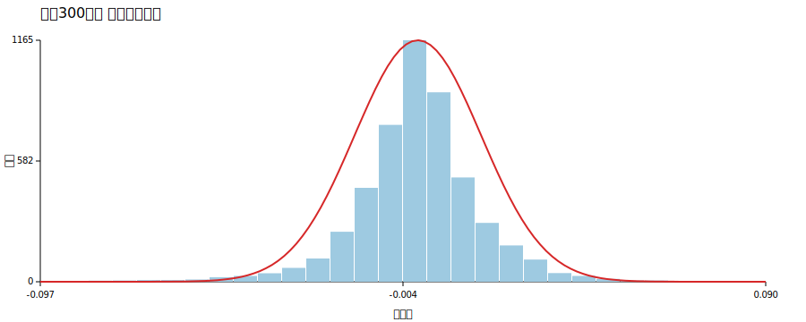

#### 中证500指数价格图

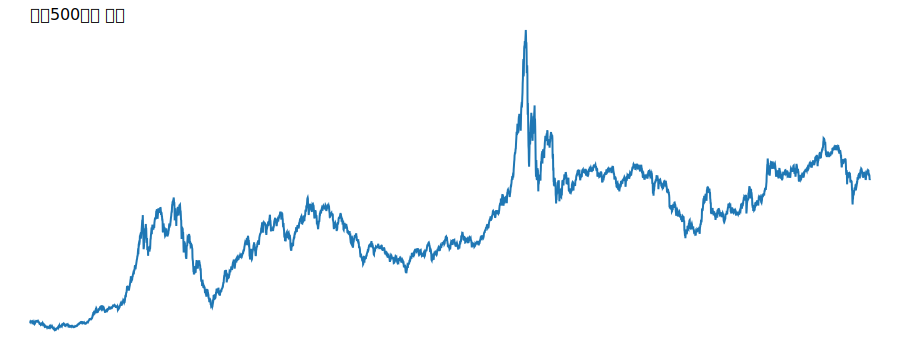

#### 中证500指数收益率直方图

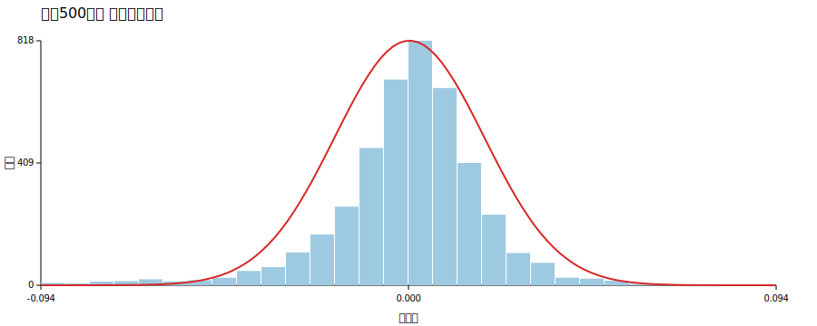

#### 上证50ETF价格图

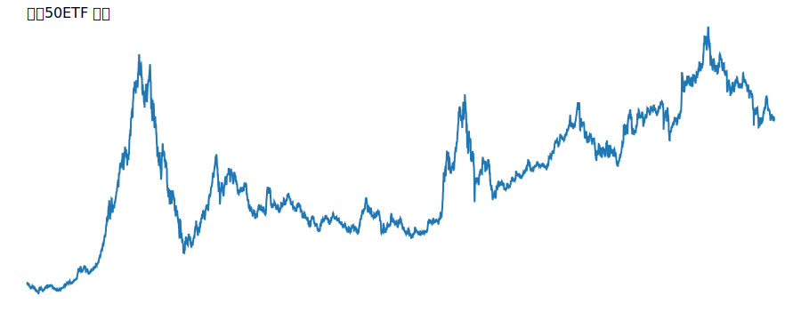

#### 上证50ETF收益率直方图

#### 沪深300期货价格图

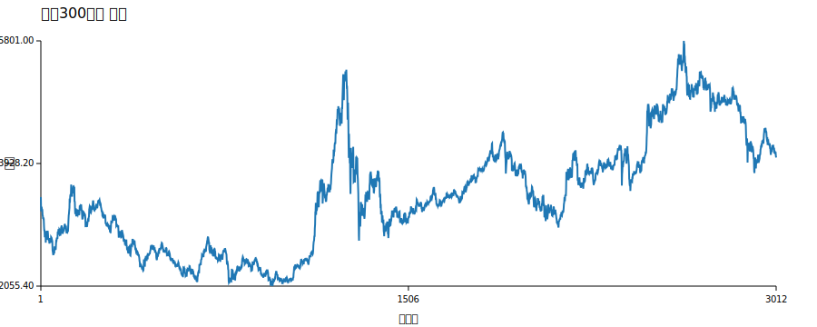

#### 沪深300期货收益率直方图

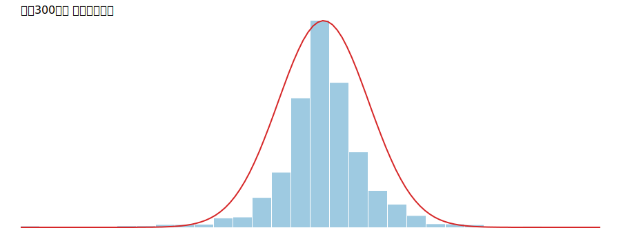

这些图说明：

- 指数和 ETF 的长期走势大体一致，牛熊切换阶段比较明显；
- 沪深300期货与现货指数走势方向较一致，但期货波动会更灵敏；
- 收益率直方图都明显集中于零附近，同时尾部较肥，和标准正态分布相比存在更强的极端波动。

### 5.2 期权样本

#### 认购期权价格图

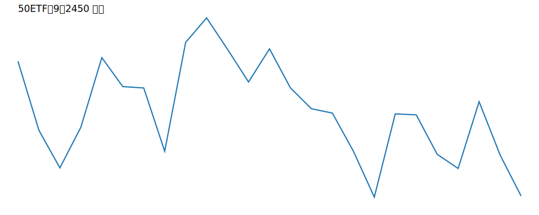

#### 认购期权收益率直方图

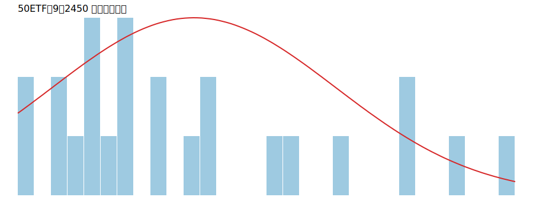

#### 认沽期权价格图

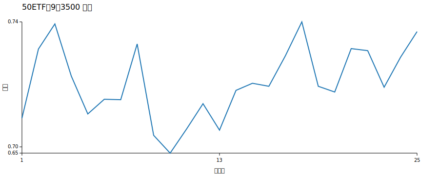

#### 认沽期权收益率直方图

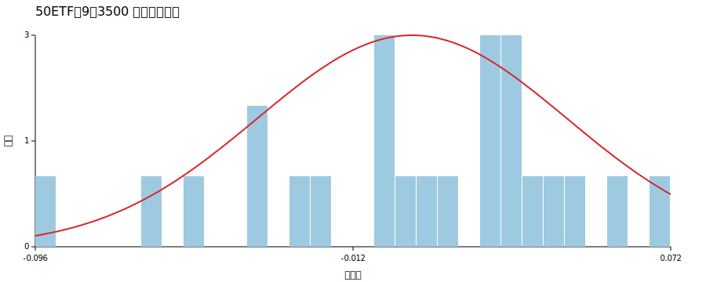

期权图像显示：

- 认购期权和 ETF 同涨同跌，认沽期权与 ETF 走势则呈反向关系；
- 期权收益率分布更为分散，极端值更多，说明杠杆效应显著；
- 在短期样本内，期权价格对市场方向变化反应非常敏感。

### 5.3 股票样本

#### 贵州茅台

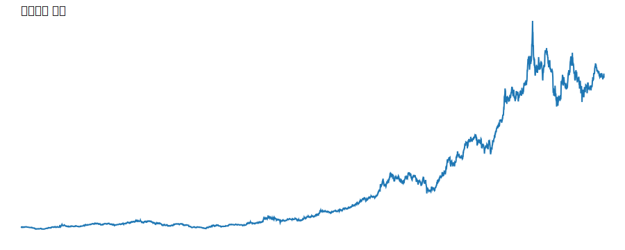

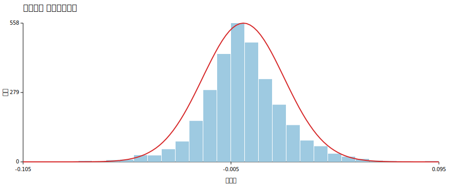

#### 中国平安

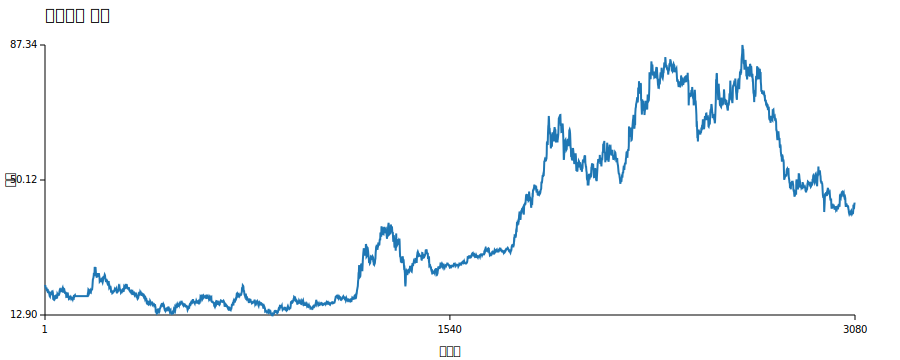

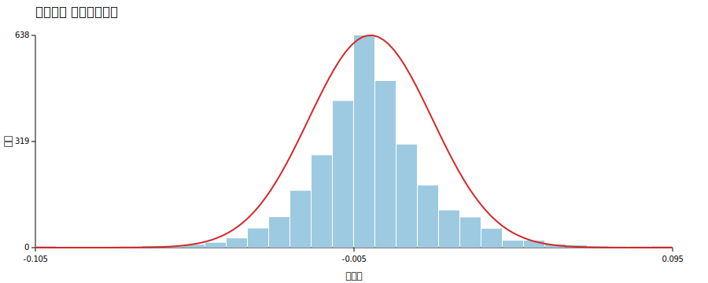

#### 长江电力

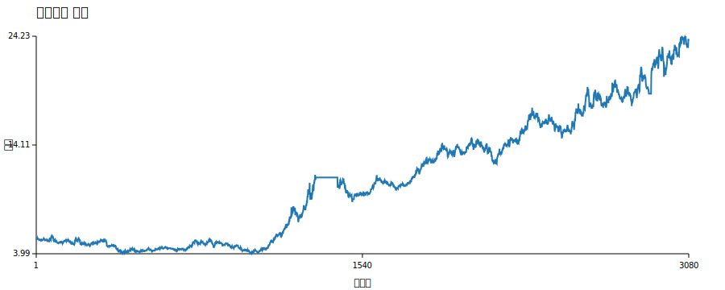

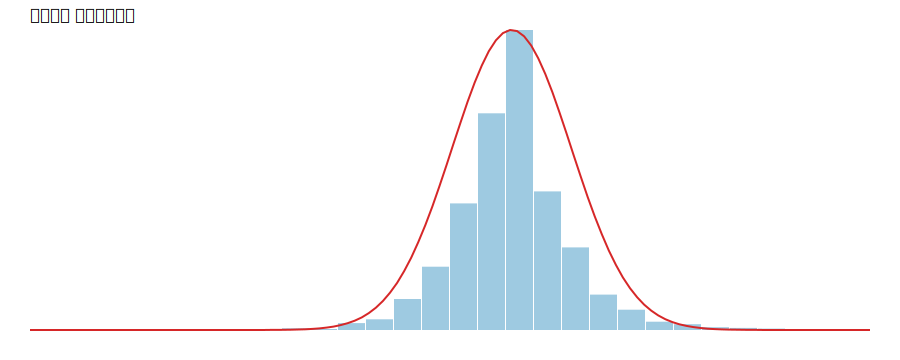

#### 中国中免

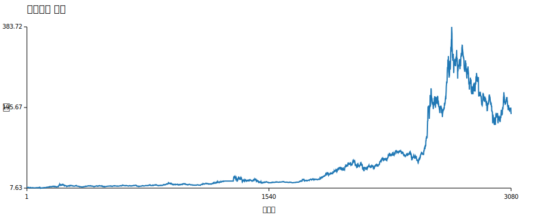

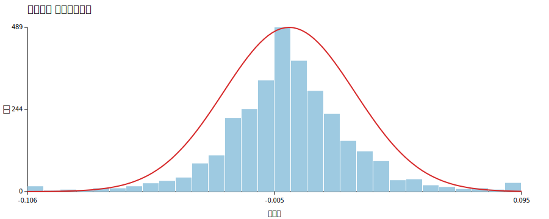

#### 恒瑞医药

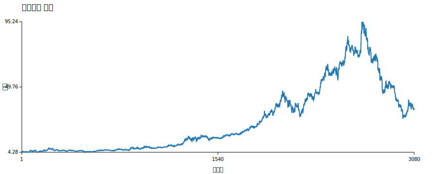

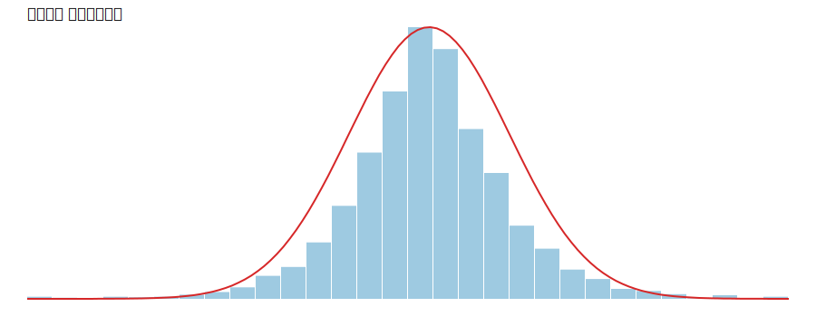

从股票图可以看到：

- 不同行业股票的价格趋势差异明显；
- 长江电力波动相对较小，防御性更强；
- 中国中免和恒瑞医药在部分区间波动更大，成长性与风险并存；
- 贵州茅台长期趋势较强，但单日收益率依然表现出明显厚尾。

## 6. 进阶分析

### 6.1 不同频率对结果的影响

| 频率 | 样本数 | 均值 | 标准差 |
| --- | --- | --- | --- |
| D | 5016 | 0.000223 | 0.016271 |
| W | 1050 | 0.001065 | 0.034762 |
| M | 249 | 0.004806 | 0.079413 |

可以看到，随着频率从日频变为周频、月频，单期收益率的均值和标准差都明显变大。这是因为统计区间拉长以后，更多日内波动被聚合进同一期收益中，因此单个观察值的波动幅度扩大。

### 6.2 隔夜收益与日内收益

| 样本数 | 隔夜均值 | 日内均值 |
| --- | --- | --- |
| 4267 | -0.000624 | 0.000959 |

这里以上证50ETF为例。结果显示：

- 隔夜收益率平均为负；
- 日内收益率平均为正。

说明样本期内的主要正收益更多发生在交易时段内，而非隔夜持有阶段。

### 6.3 上午与下午收益差异

| 样本数 | 上午均值 | 下午均值 |
| --- | --- | --- |
| 113 | 0.000647 | -0.00012 |

上午平均收益为正、下午平均收益略为负，说明开盘后到午间这段时间价格表现整体稍强，而下午则相对偏弱。这种现象可能与开盘时的信息集中释放、午后交易活跃度变化有关。

### 6.4 等时间与等交易量间距比较

| 采样 | 样本数 | 标准差 |
| --- | --- | --- |
| clock | 20 | 0.001397 |
| volume | 19 | 0.025516 |

等交易量间距下的收益率标准差明显更高，说明当市场成交量集中的时段被单独切分出来后，价格变动会呈现更强的波动。这也从侧面说明固定时间间距会“平均化”不同活跃时段的风险。

### 6.5 指数、ETF、期货关系

| 资产 | 上证50指数 | 上证50ETF | 上证50期货 |
| --- | --- | --- | --- |
| 上证50指数 | 1.0 | 0.992588 | 0.951211 |
| 上证50ETF | 0.992588 | 1.0 | 0.961526 |
| 上证50期货 | 0.951211 | 0.961526 | 1.0 |

三者之间的收益率相关性都非常高，尤其是指数与 ETF 之间接近 0.993。这说明：

- ETF 对指数跟踪非常紧密；
- 股指期货与现货体系总体一致；
- 三者都可以看作同一风险因子的不同交易载体。

### 6.6 股票特征与收益率关系

| 股票 | 行业 | 总市值(亿) | 均值 | 标准差 |
| --- | --- | --- | --- | --- |
| 贵州茅台 | 日常消费 | 23553.71 | 0.000941 | 0.019648 |
| 中国平安 | 金融 | 7988.47 | 0.00024 | 0.019458 |
| 长江电力 | 公用事业 | 5417.11 | 0.00048 | 0.012429 |
| 中国中免 | 可选消费 | 3705.8 | 0.000959 | 0.026699 |
| 恒瑞医药 | 医疗保健 | 2162.48 | 0.000628 | 0.021153 |

从这 5 只股票看：

- 总市值较大并不必然意味着更高收益；
- 防御型行业如公用事业波动率较低；
- 可选消费和医药板块波动率更大；
- 行业属性对波动特征的影响比单纯市值大小更明显。

### 6.7 股票相关性与期货相关性

#### 股票相关性

| 股票 | 贵州茅台 | 中国平安 | 长江电力 | 中国中免 | 恒瑞医药 |
| --- | --- | --- | --- | --- | --- |
| 贵州茅台 | 1.0 | 0.408332 | 0.247054 | 0.402292 | 0.412408 |
| 中国平安 | 0.408332 | 1.0 | 0.389866 | 0.349641 | 0.305954 |
| 长江电力 | 0.247054 | 0.389866 | 1.0 | 0.167703 | 0.162979 |
| 中国中免 | 0.402292 | 0.349641 | 0.167703 | 1.0 | 0.389881 |
| 恒瑞医药 | 0.412408 | 0.305954 | 0.162979 | 0.389881 | 1.0 |

#### 期货相关性

| 期货 | 上证50期货 | 中证500期货 | 沪深300期货 |
| --- | --- | --- | --- |
| 上证50期货 | 1.0 | 0.6893 | 0.930113 |
| 中证500期货 | 0.6893 | 1.0 | 0.863513 |
| 沪深300期货 | 0.930113 | 0.863513 | 1.0 |

结论如下：

- 股票之间普遍为正相关，但相关性强弱存在差异；
- 长江电力与其他股票相关性较低，说明其行业属性和防御特征更强；
- 股指期货之间的相关性整体高于个股，尤其上证50期货与沪深300期货相关性非常高。

### 6.8 期权与 ETF 关系

| 资产 | 50ETF | 50ETF购9月2450 | 50ETF沽9月3500 |
| --- | --- | --- | --- |
| 50ETF | 1.0 | 0.990794 | -0.981637 |
| 50ETF购9月2450 | 0.990794 | 1.0 | -0.967129 |
| 50ETF沽9月3500 | -0.981637 | -0.967129 | 1.0 |

认购期权与 ETF 高度正相关，认沽期权与 ETF 高度负相关，这与期权的基本方向性完全一致，也说明样本中选取的合约具有较好的代表性。

### 6.9 期权横截面关系

| 期权 | 样本数 | 均值 | 标准差 |
| --- | --- | --- | --- |
| 50ETF购9月2850 | 25 | -0.062026 | 0.236659 |
| 50ETF购9月2900 | 25 | -0.076616 | 0.2591 |
| 50ETF购9月2950 | 25 | -0.090222 | 0.269491 |
| 50ETF购9月3000 | 25 | -0.097753 | 0.273865 |
| 50ETF购9月3100 | 25 | -0.098126 | 0.234793 |

随着行权价变化，不同期权的收益率分布和波动率会发生变化。整体看，行权价更远的期权价格更敏感，也更容易体现出较强波动。

### 6.10 日历效应

#### 按星期分组

| 星期 | 平均收益 |
| --- | --- |
| 0 | 0.00096 |
| 1 | 0.00013 |
| 2 | 0.000631 |
| 3 | -0.001075 |
| 4 | 0.000488 |

星期四平均收益最低，星期一和星期三之间差异较明显，说明日收益在一周内部并非完全均匀分布。

#### 按月份分组

| 月份 | 平均收益 |
| --- | --- |
| 1 | -0.000039 |
| 2 | 0.00164 |
| 3 | -0.000123 |
| 4 | 0.001068 |
| 5 | -0.000049 |
| 6 | -0.00085 |
| 7 | 0.000428 |
| 8 | -0.000898 |
| 9 | -0.00003 |
| 10 | -0.000015 |
| 11 | 0.000393 |
| 12 | 0.001437 |

2 月、4 月和 12 月的平均收益偏高，6 月和 8 月偏低，说明样本中存在一定的月份效应，但这种现象仍需更严谨的统计检验才能得出强结论。

### 6.11 节日效应

节后首日收益率样本显示，节后表现并不稳定，既有明显正收益，也有明显负收益。因此，从这次简单统计看，节日效应存在但不够稳定，难以直接形成强交易结论。

### 6.12 日内季节效应

| 时段 | 平均收益 |
| --- | --- |
| 09:30 | 0.000009 |
| 10:00 | 0.000002 |
| 10:30 | 0.00001 |
| 11:00 | -0.000008 |
| 11:30 | 0.0 |
| 13:00 | -0.000004 |
| 13:30 | 0.000002 |
| 14:00 | -0.000009 |
| 14:30 | -0.000012 |
| 15:00 | -0.000041 |

整体上：

- 上午早盘略强；
- 午后收益趋弱；
- 临近收盘阶段平均收益最低。

这说明日内收益并非均匀分布，市场微观结构和交易行为会在不同时间段产生明显差异。

## 7. 总结

本次作业通过指数、ETF、股票、期货和期权等多类资产样本，对金融时间序列做了基础统计分析，并进一步完成了多个扩展问题的研究。总体结论如下：

1. 绝大多数资产的收益率都明显偏离正态分布，具有尖峰厚尾特征。
2. 不同资产之间的风险特征差异明显，股票、指数、期货和期权的波动层级依次递增。
3. 同一指数体系下，指数、ETF 和期货高度相关。
4. 股票相关性明显低于股指期货相关性，行业分散可以降低组合内部同步波动。
5. 高频数据揭示了隔夜/日内差异、上午/下午差异以及日内季节效应，说明时间尺度对统计结论影响很大。

