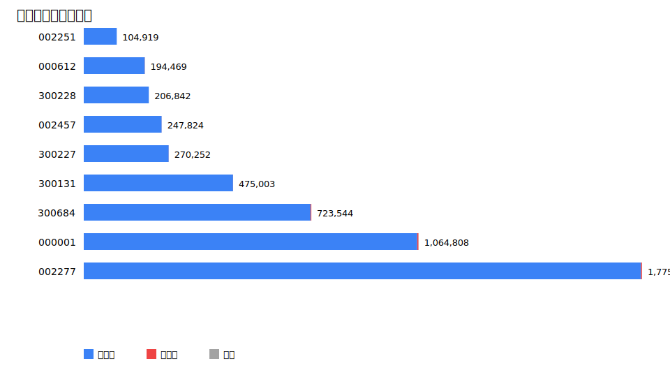
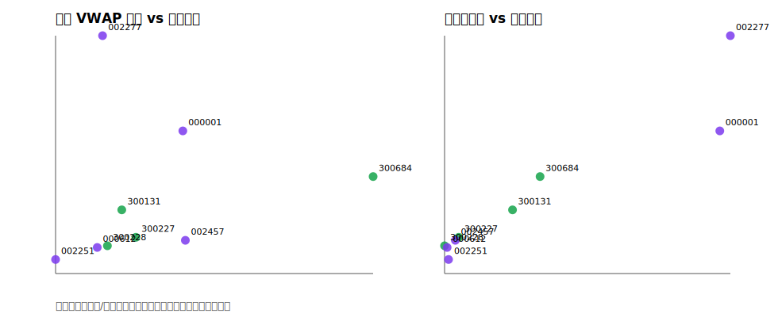

# 中国 A 股逐笔下单数据分析

## 1. 数据与处理口径

原始数据为 `hw10/tickdata.zip`。压缩包中出现 10 个股票目录，其中 `301115` 为空目录；实际可用于订单和成交分析的股票为 9 只。样本交易日为 2024-12-18 至 2024-12-31 的 10 个交易日。

本文只使用每只股票每天上午/下午的 `hq_order_spot.csv` 计算订单数量和相邻下单间隔，并使用 `hq_trade_spot.csv` 中价格大于 0 的成交记录计算期间成交额与 VWAP 价格。`OrderType=1` 记为市价单，`OrderType=2` 记为限价单，`OrderType=U` 记为其他/特殊订单。相邻下单间隔只在同一个半日文件内部计算，避免把午休和隔夜间隔混入分布。

## 2. 限价单与市价单统计

| 股票 | 名称 | 板块 | 订单总数 | 限价单 | 市价单 | 其他 | 限价占比 | 市价占比 | VWAP | 成交额 |
| --- | --- | --- | --- | --- | --- | --- | --- | --- | --- | --- |
| 002277 | 友阿股份 | 深市中小板/主板 | 1,775,242 | 1,771,617 | 3,392 | 233 | 99.80% | 0.19% | 6.859 | 147.02亿 |
| 000001 | 平安银行 | 深市主板 | 1,064,808 | 1,060,366 | 4,030 | 412 | 99.58% | 0.38% | 11.8 | 141.96亿 |
| 300684 | 中石科技 | 创业板 | 723,544 | 720,924 | 2,599 | 21 | 99.64% | 0.36% | 23.52 | 55.38亿 |
| 300131 | 英唐智控 | 创业板 | 475,003 | 474,670 | 306 | 27 | 99.93% | 0.06% | 8.039 | 42.10亿 |
| 300227 | 光韵达 | 创业板 | 270,252 | 270,010 | 149 | 93 | 99.91% | 0.06% | 8.912 | 16.23亿 |
| 002457 | 青龙管业 | 深市中小板/主板 | 247,824 | 247,606 | 159 | 59 | 99.91% | 0.06% | 11.96 | 14.56亿 |
| 300228 | 富瑞特装 | 创业板 | 206,842 | 206,744 | 71 | 27 | 99.95% | 0.03% | 7.157 | 9.37亿 |
| 000612 | 焦作万方 | 深市主板 | 194,469 | 193,886 | 382 | 201 | 99.70% | 0.20% | 6.53 | 10.58亿 |
| 002251 | 步步高 | 深市中小板/主板 | 104,919 | 104,866 | 49 | 4 | 99.95% | 0.05% | 3.964 | 11.30亿 |

订单数量最高的是 `002277`（友阿股份），共 1,775,242 笔；最低的是 `002251`（步步高），共 104,919 笔。所有有效股票均以限价单为绝对主体，限价单占比接近或超过 99%，市价单和 `U` 类订单数量很小。这说明样本中的深市逐笔委托以限价委托为主，市价委托不是订单流的主要来源。

`301115` 因目录为空，无法纳入统计。若作业必须严格保留 10 只股票，可把它作为“原始数据缺失”的样本列示，而不应填造订单数。

### 订单数与股票特征关系

| 特征 | Pearson相关 | Spearman相关 |
| --- | --- | --- |
| 成交 VWAP 价格 | 0.1672 | 0.5 |
| 期间成交额 | 0.9481 | 0.9333 |
| 平均订单股数 | 0.2981 | 0 |

从样本看，订单总数与期间成交额的相关性最强，说明订单活跃度更接近流动性/成交活跃程度；与成交 VWAP 价格的相关性弱得多，不能说明“股价越高订单越多”。平均订单股数与订单数也不是稳定正相关，说明大订单规模和订单频率是两个不同维度。原始数据未包含总股本或流通股本，因此本文没有直接计算市值；若引入外部市值数据，建议进一步比较订单数与流通市值、换手率之间的关系。

## 3. 相邻下单时间间隔分布

由于逐笔数据时间戳精度为毫秒，同一毫秒内可能出现多笔订单。连续分布拟合不能处理 0 间隔，因此表中单独报告 0 间隔占比；指数分布、对数正态分布和幂律分布均只对正间隔拟合。评价指标使用 AIC 和 KS 距离：AIC 越小越好，KS 越小越好。

| 股票 | 名称 | 间隔数 | 正间隔数 | 0间隔占比 | 均值(s) | 中位数(s) | 90%分位(s) | 99%分位(s) | AIC最佳分布 |
| --- | --- | --- | --- | --- | --- | --- | --- | --- | --- |
| 000001 | 平安银行 | 1,064,788 | 759,258 | 28.69% | 0.2015 | 0.09 | 0.51 | 1.37 | 对数正态分布 |
| 000612 | 焦作万方 | 194,449 | 126,399 | 35.00% | 1.21 | 0.49 | 3.14 | 8.95 | 对数正态分布 |
| 002251 | 步步高 | 104,899 | 97,283 | 7.26% | 1.572 | 0.72 | 3.92 | 11.32 | 对数正态分布 |
| 002277 | 友阿股份 | 1,775,222 | 1,315,592 | 25.89% | 0.1163 | 0.04 | 0.27 | 1.11 | 幂律分布 |
| 002457 | 青龙管业 | 247,804 | 186,701 | 24.66% | 0.8194 | 0.33 | 2.15 | 6.19 | 对数正态分布 |
| 300131 | 英唐智控 | 474,983 | 369,966 | 22.11% | 0.4135 | 0.17 | 1.06 | 3.16 | 对数正态分布 |
| 300227 | 光韵达 | 270,232 | 195,602 | 27.62% | 0.7819 | 0.3 | 2.06 | 6.02 | 对数正态分布 |
| 300228 | 富瑞特装 | 206,822 | 133,993 | 35.21% | 1.141 | 0.36 | 3.01 | 9.56 | 幂律分布 |
| 300684 | 中石科技 | 723,524 | 463,279 | 35.97% | 0.3302 | 0.1 | 0.88 | 2.73 | 幂律分布 |

按 AIC 选择的最佳分布汇总为：对数正态分布 6 只；幂律分布 3 只；按 KS 距离选择的最佳分布汇总为：对数正态分布 9 只。综合两类指标，对数正态分布最稳健：它在 6 只股票上取得最低 AIC，并在全部 9 只有效股票上取得最低 KS 距离。这与市场微观结构直觉一致：订单到达不是稳定强度的泊松过程，存在开盘集合竞价、连续竞价中的交易活跃时段、信息冲击和流动性聚集，因此间隔分布具有右偏、厚尾和波动聚集特征。指数分布要求无记忆性和恒定到达率，拟合效果较差；幂律分布能描述尾部但在主体区间的整体拟合稳定性较弱。

详细拟合结果保存在 `outputs/tables/fit_results.csv`，其中 `best_by_aic=True` 表示该股票按 AIC 最优。

## 4. 结论

1. 样本中有效数据为 9 只股票，`301115` 缺失订单文件。
2. 限价单占绝对多数，市价单比例很低，订单类型结构在不同股票间差异不大。
3. 订单数量差异很大，主要与成交活跃度/流动性相关，而不是简单由股价水平解释。
4. 相邻订单正间隔分布整体以对数正态分布拟合最好；AIC 下少数股票偏向幂律，但 KS 指标显示对数正态的整体分布贴合度更稳定。
