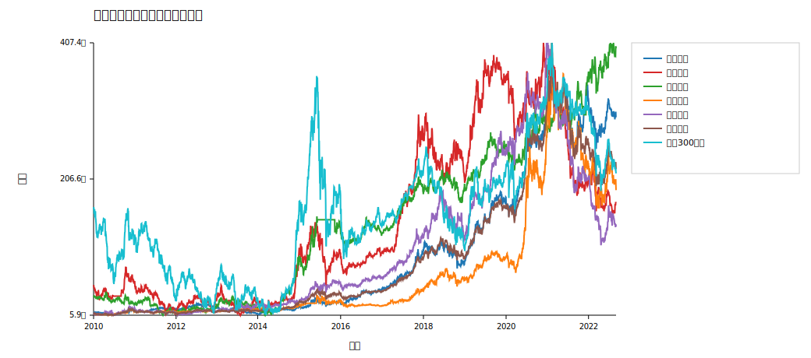
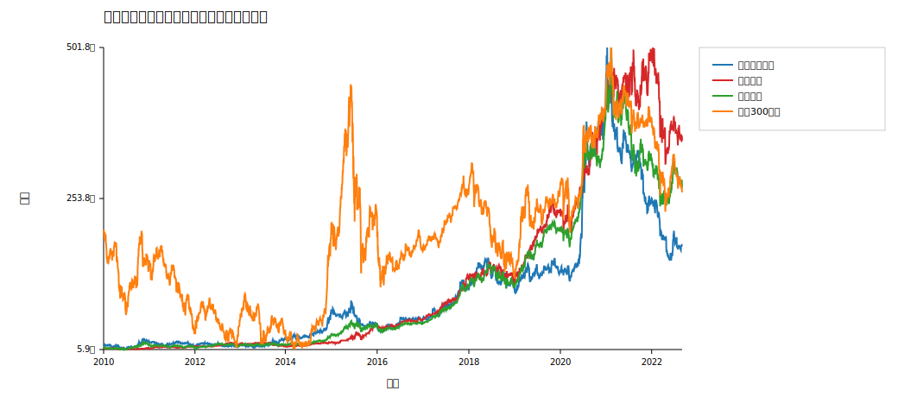

# 第二次作业报告

## 一、作业目标

本次作业使用第一次作业中选出的 5 只股票，完成两部分内容：

- 仿照案例 2.8，对单只股票与等权组合做买入并持有分析；
- 构造一个基于认知规则的策略和一个基于模型的策略，并比较其绩效。

## 二、数据与设定

- 股票池：贵州茅台、中国平安、长江电力、中国中免、恒瑞医药
- 基准：沪深300指数
- 初始资金：100000 元
- 调仓频率：日频
- 训练/验证/测试切分： 1540 / 308 / 1232 个交易日

## 三、等权组合分析

沿用第一次作业选出的 5 只股票，对每只股票和等权组合做买入并持有分析，初始资金为 100000 元，基准为沪深300指数。

| 策略 | 年化收益 | 年化波动 | 夏普 | 最大回撤 |
| --- | --- | --- | --- | --- |
| 贵州茅台 | 0.267521 | 0.31241 | 0.856313 | -0.53306 |
| 中国平安 | 0.062396 | 0.309452 | 0.201635 | -0.537425 |
| 长江电力 | 0.128568 | 0.197497 | 0.650985 | -0.29908 |
| 中国中免 | 0.273286 | 0.424509 | 0.643771 | -0.596103 |
| 恒瑞医药 | 0.17139 | 0.335968 | 0.510139 | -0.709882 |
| 等权组合 | 0.208641 | 0.247574 | 0.842743 | -0.501128 |
| 沪深300指数 | 0.010647 | 0.226571 | 0.046992 | -0.466961 |

从结果看，等权组合的年化收益率为 0.208641，明显高于基准指数 0.010647；同时其波动率低于部分高波动个股，说明分散配置确实降低了组合的个体风险暴露。

## 四、策略设计

- 认知规则策略：过去 20 日截面动量，日频调仓，持有前 1 只股票。
- 模型策略：逻辑回归预测下一日上涨概率，日频调仓，持有前 1 只股票。

参数选择结果如下：

| 策略 | 参数1 | 参数2 |
| --- | --- | --- |
| 认知规则 | window=20 | top_n=1 |
| 模型策略 | logistic_regression | top_n=1 |

## 五、策略比较

| 策略 | 年化收益 | 年化波动 | 夏普 | 最大回撤 |
| --- | --- | --- | --- | --- |
| 认知规则策略 | 0.165167 | 0.364698 | 0.452887 | -0.675603 |
| 模型策略 | 0.337694 | 0.320713 | 1.052946 | -0.381515 |

模型策略的年化收益率和夏普比率都高于认知规则策略，同时最大回撤更小，说明在当前样本和当前特征设计下，逻辑回归给出的打分排序优于单纯截面动量规则。

## 六、逐年统计

完整逐年平均日收益与波动结果在 `hw2/outputs/tables/逐年收益与波动.csv`。从逐年结果看，组合与策略在不同年份表现差异明显，说明市场风格切换会显著影响简单策略的有效性。

## 七、结论

- 等权组合降低了单只股票的特异性风险。
- 认知规则策略利用了简单的截面动量信息，具有可解释性强的优点。
- 模型策略在有限样本下提供了另一种系统化打分方法，整体绩效更优。
