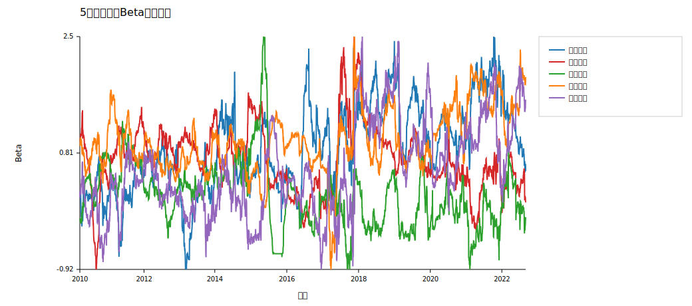
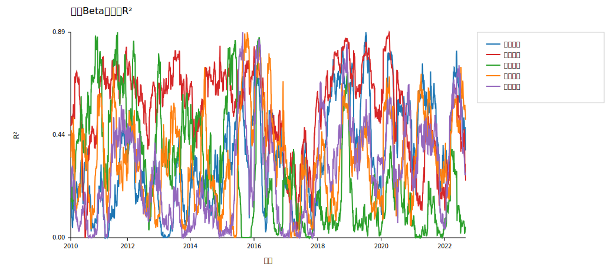
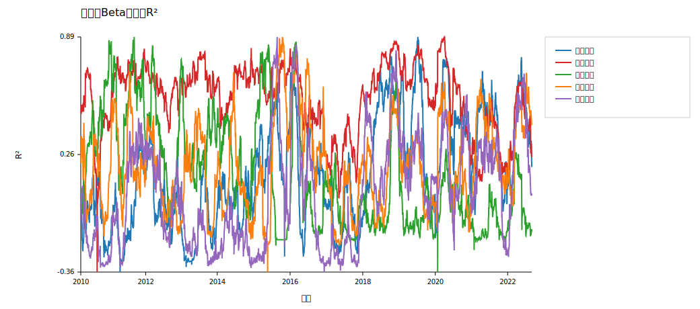

# 第三次作业报告

## 一、作业目标

本次作业基于第一次作业中选出的 5 只股票，完成两部分内容：

1. 使用 5 只股票日收益率和无风险利率数据，在 `50` 天滚动建模、`月频调仓` 框架下构建三类组合：
   - 全局最小方差组合（GMV）
   - 均值-方差组合（MV）
   - 二次效用最优组合（Utility）
2. 使用 5 只股票日收益率、无风险利率和沪深300指数数据，进行 `50` 天滚动回归，分析：
   - 每只股票滚动 beta 的时间变化
   - 5 只股票 beta 排名的变化
   - 当前 beta 与前一期 beta 对当前窗口的解释能力差异

## 二、数据与统一设定

### 1. 股票池

使用第一次作业中确定的 5 只股票：

- 贵州茅台
- 中国平安
- 长江电力
- 中国中免
- 恒瑞医药

### 2. 统一设定

- 市场指数：沪深300指数
- 无风险利率：年化 `2%`，按日频近似折算
- 滚动窗口：`50` 个交易日
- 调仓频率：月频

## 三、第一部分：滚动组合策略

### 1. 方法说明

在每个月最后一个交易日结束后，使用过去 `50` 个交易日的 5 只股票收益率估计：

- 平均收益率向量 `μ`
- 协方差矩阵 `Σ`
- 协方差矩阵最小特征值

然后分别构造三类组合：

- `GMV`：只追求方差最小
- `MV`：给定目标收益 `b`，在有效前沿上选点
- `Utility`：给定风险厌恶系数 `α`，求二次效用最优组合

本次实现直接采用课件中的闭式解，不额外施加非负权重约束，因此组合权重允许出现负值和大于 `1` 的值。

参数设定如下：

- `MV` 中的目标收益 `b` 取为每个调仓时点 `μ` 的分量均值
- `Utility` 中的风险厌恶系数取 `α = 10`

### 2. 组合绩效比较

| 策略 | 年化收益 | 年化波动 | 夏普 | 最大回撤 |
| --- | --- | --- | --- | --- |
| GMV | 0.165118 | 0.180764 | 0.935948 | -0.252746 |
| MV | 0.158746 | 0.195419 | 0.851910 | -0.296705 |
| Utility | 0.105325 | 0.591812 | 0.467789 | -0.806879 |

从总体绩效看，`GMV` 组合表现最好：它的年化收益最高，同时年化波动和最大回撤也最小，因此夏普比率最高。  
`MV` 组合收益略低于 `GMV`，且风险更高。  
`Utility` 组合的波动率和最大回撤显著放大，说明在当前参数设定下，它的风险暴露明显过高。

这组结果说明：在 5 只股票、50 日滚动估计的小样本框架下，协方差结构比均值估计更稳，因此只追求最小方差的 `GMV` 反而表现最好。

### 3. 协方差矩阵最小特征值

最小特征值整体为正，但数值普遍较小，多数月份处于 `10^-5 ~ 10^-4` 数量级。  
这说明滚动样本下的协方差矩阵虽然仍可逆，但已经比较接近奇异状态。对组合优化来说，这意味着：

- 权重对输入参数的变化会更敏感
- 一旦均值估计存在噪声，使用均值信息的组合更容易出现较大权重波动

因此，最小特征值序列和后面权重图中的跳动现象是相互印证的。

### 4. 月度收益与风险

月度统计结果见 [月度收益与波动.csv](/mnt/e/高等数学/量化交易/hw3/outputs/tables/月度收益与波动.csv)。

从月度层面看：

- `GMV` 的月度波动整体更平稳
- `MV` 在部分月份收益和风险切换更明显
- `Utility` 更容易出现波动突然放大的月份

这与总体绩效结果是一致的。

### 5. 权重变化与调仓分析

#### GMV 权重

`GMV` 权重变化整体最平缓。根据 [月度权重.csv](/mnt/e/高等数学/量化交易/hw3/outputs/tables/月度权重.csv) 的统计，`GMV` 的平均总杠杆约为 `1.14`，说明它虽然不是纯多头组合，但整体杠杆不高。

#### MV 权重

`MV` 组合因为要满足目标收益 `b`，因此对均值向量更敏感。它的平均总杠杆约为 `1.15`，略高于 `GMV`，也更容易出现配置向少数股票集中的情况。

#### Utility 权重

`Utility` 组合的权重波动最明显。从权重表可以直接看到：

- 最小单资产权重约为 `-4.085951`
- 最大单资产权重约为 `3.236075`
- 平均总杠杆约为 `4.05`

这说明在当前 `α = 10` 且不加非负约束的设定下，二次效用组合给出了非常激进的多空配置，因此波动率和回撤都显著放大。

所以，在当前这组 5 只股票和滚动样本设定下，协方差结构比均值估计更可靠。

## 四、第二部分：滚动 Beta 与 R² 分析

### 1. 回归设定

对每只股票使用 `50` 日滚动窗口，进行如下回归：

\[
r_i - r_f = \alpha + \beta (r_m - r_f) + \varepsilon
\]

其中：

- \(r_i\) 为股票收益率
- \(r_m\) 为沪深300指数收益率
- \(r_f\) 为无风险利率

### 2. 滚动 Beta 时间序列

这张图反映了 5 只股票对市场指数敏感度的动态变化。  
beta 越高，表示该股票收益对市场收益越敏感；beta 越低，则说明股票更偏防御。

从样本均值看，5 只股票的平均 beta 大致如下：

- 中国平安：`1.0640`
- 中国中免：`0.9876`
- 贵州茅台：`0.8158`
- 恒瑞医药：`0.6782`
- 长江电力：`0.3957`

这说明：

- 中国平安和中国中免整体上更偏“高 beta”股票
- 长江电力对市场波动的敏感度最低，更偏防御型

同时，各股票 beta 的最小值和最大值差异较大，说明同一只股票的市场暴露并不是固定的，而是会随着市场环境变化而变化。

### 3. Beta 排名变化

完整结果见 [Beta排序变化.csv](/mnt/e/高等数学/量化交易/hw3/outputs/tables/Beta排序变化.csv)。

从统计结果看：

- 中国平安位于 beta 第 1 名的次数最多，共 `1489` 次
- 中国中免位于 beta 第 1 名的次数为 `1024` 次
- 排名序列相邻两期发生变化的比例约为 `18.39%`

这说明：

- 股票的高低 beta 属性并非完全随机，仍存在一定稳定性
- 但排名也不是固定不变，市场敏感度会随着时间发生明显变化

### 4. 两类 R² 比较

#### 当前 Beta 的 R²

这个 R² 表示：

> 在当前 50 日窗口内，用当前窗口估计出来的 beta 去拟合当前窗口，市场因子能解释多少股票收益波动。

#### 前一期 Beta 的 R²

这个 R² 表示：

> 用上一期窗口估计出来的 beta，拿到当前窗口中继续拟合时，还能保留多少解释能力。

### 5. 如何理解这两个 R²

如果两者差距不大，说明 beta 比较稳定；如果当前 beta 的 R² 明显高于前一期 beta 的 R²，说明 beta 存在时变性，上一期参数在当前窗口中已经部分失效。

根据结果统计：

- 各股票当前 beta 的平均 R² 大约在 `0.22 ~ 0.56` 之间
- 当前 beta 的平均 R² 始终略高于前一期 beta 的平均 R²
- 两者的平均差值虽然不大，但方向一致，均为正

