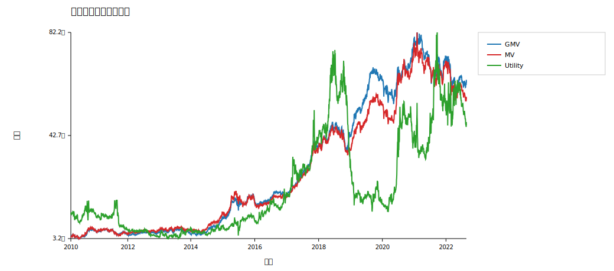
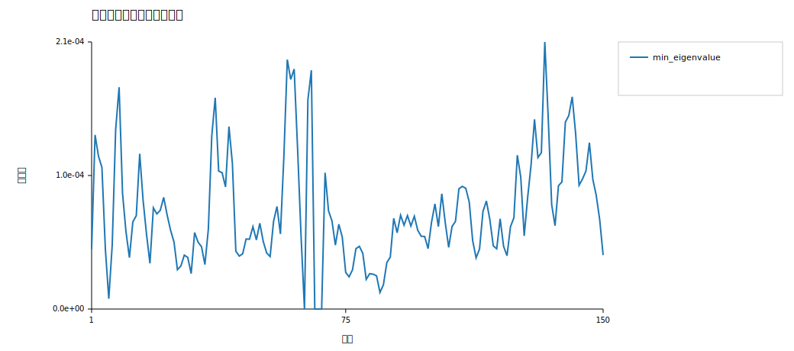
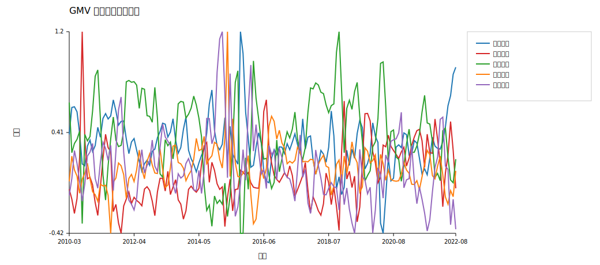
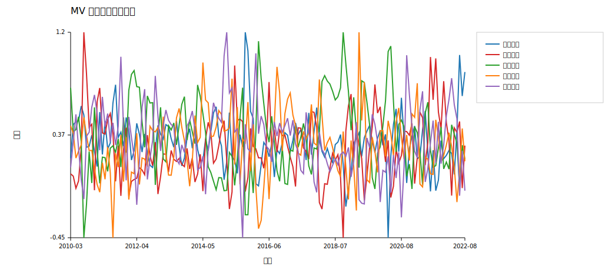
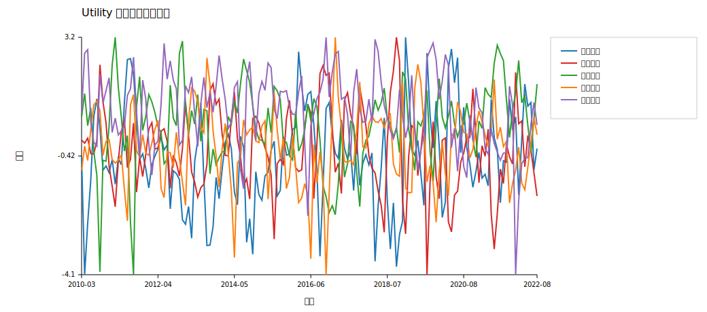

# 第三次作业报告

## 一、作业目标

本部分使用第一次作业中的 5 只股票日收益率，在 50 天滚动建模、月频调仓框架下构建三类组合：全局最小方差组合、均值-方差最优组合与二次效用最优组合。

## 二、模型设定

- 滚动窗口：50 个交易日
- 调仓频率：月频
- 按课件闭式解直接计算权重，不额外加入非负权重约束，因此允许出现空头和杠杆权重
- 无风险利率：年化 2%，折算为日频近似（用于 Sharpe 指标和第二部分回归）
- 均值-方差组合目标收益 b：每月取过去 50 日平均收益率向量 `μ` 的分量均值
- 二次效用组合风险厌恶系数 α：10.0

## 三、组合绩效比较

| 策略 | 年化收益 | 年化波动 | 夏普 | 最大回撤 |
| --- | --- | --- | --- | --- |
| GMV | 0.165118 | 0.180764 | 0.935948 | -0.252746 |
| MV | 0.158746 | 0.195419 | 0.85191 | -0.296705 |
| Utility | 0.105325 | 0.591812 | 0.467789 | -0.806879 |

从结果看，GMV 组合在这一版设定下表现最好，年化收益率和夏普比率都高于另外两种组合。这说明在 5 只股票的小样本下，协方差结构往往比均值估计更稳健。

## 四、协方差矩阵最小特征值

最小特征值整体较小但保持为正，说明协方差矩阵在多数滚动窗口下接近奇异但仍可用于优化。这也解释了为什么均值-方差和效用最优组合的权重变化会比较敏感。

## 五、月度收益与风险

详细月度统计见 `月度收益与波动.csv`。该表给出了每个月三种策略的平均日收益和收益率标准差，可直接用于月度层面的横向比较。

## 六、权重变化与调仓分析

从权重变化上看：

- GMV 组合通常更均衡，月度权重变化较平滑；
- MV 组合通过目标收益 b 在有效前沿上选点，因此对均值估计更敏感；
- Utility 组合通过风险厌恶系数 α 控制风险偏好；在 α 较小且不加非负约束时，权重可能出现更明显的杠杆特征；
- 当最小特征值下降时，优化结果更容易出现较大的权重波动。

## 七、结论

- GMV 组合在本次样本下表现最稳健；
- MV 和 Utility 都会用到均值估计，因此在滚动小样本环境下更容易受到噪声影响；
- 月频调仓下，三类组合的权重变化和协方差矩阵稳定性有较强联系。
