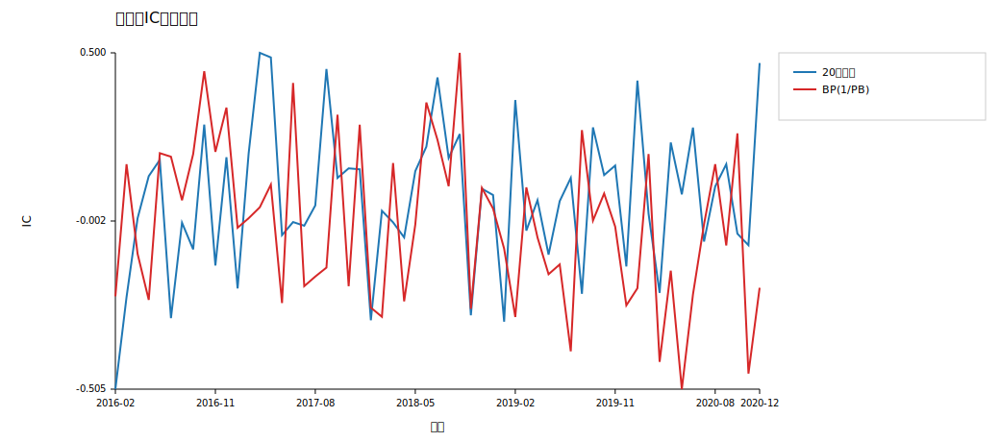
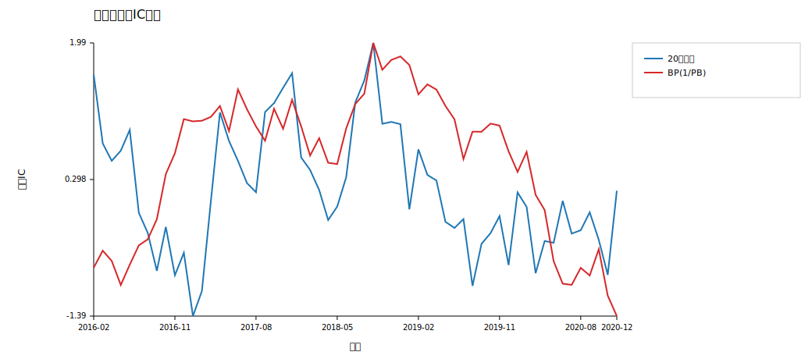
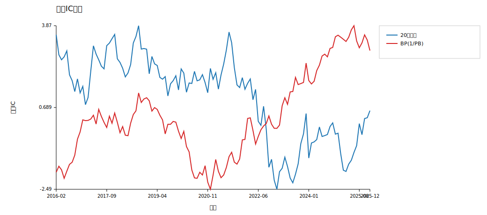
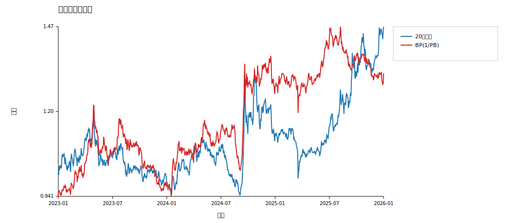
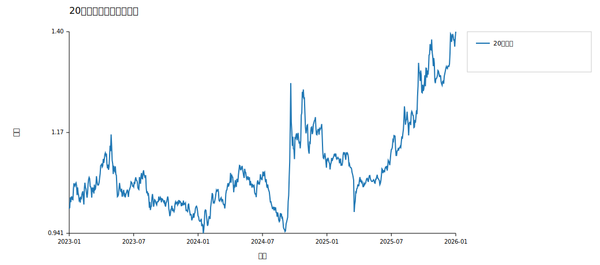
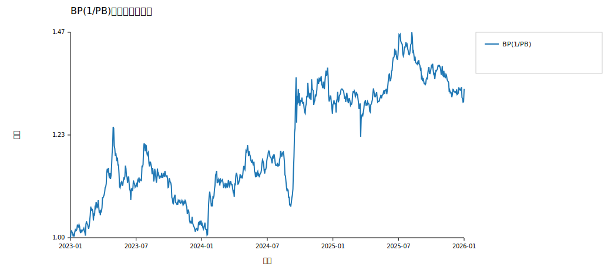
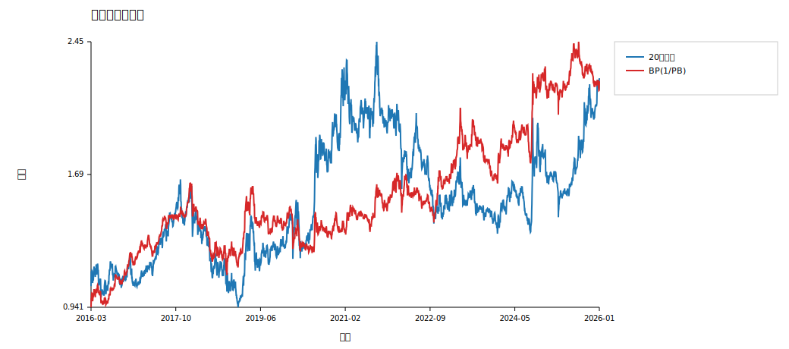

# 第四次作业报告

## 一、研究目的

本次实验基于新版 `hw4/HS300_data.zip` 数据，目标是完整演示“原始面板数据 -> 因子构造 -> 因子评价 -> 单因子组合回测 -> 结果分析”的标准流程。

相比直接寻找高收益策略，本次作业更强调两个问题：

- 一个因子在训练集内是否具有可解释的预测能力；
- 一个因子在验证集和测试集中是否还能维持相对稳定的表现。

本报告分别选择一个技术面因子和一个基本面因子进行比较：

- 技术因子：20日动量
- 基本面因子：BP = 1 / PB

## 二、数据说明与样本划分

本次实验使用新版沪深300日频面板数据，共 300 只股票、2442 个交易日、119 个有效月度调仓点。

数据文件以“每个交易日一个 CSV”的方式组织，每个文件提供当日 300 只股票的价格、估值、盈利能力等横截面信息。为了和课程要求一致，本实验采用月频调仓，并把月末最后一个交易日作为调仓时点。

- 训练集：2016-01-04 至 2020-12-31
- 验证集：2021-01-01 至 2022-12-31
- 测试集：2023-01-01 至 2026-01-20

设置验证集的目的，是避免只凭训练集结果选因子。训练集负责提出和初筛因子，验证集负责检查因子的样本外稳定性，测试集只在最终设定固定后进行一次完整回测。

## 三、因子定义与经济含义

### 1. 技术因子：20日动量

定义：`Momentum20_t = close_t / close_(t-20) - 1`。

这个因子衡量股票过去约一个月的价格强弱。若一个股票在过去 20 个交易日上涨更多，则该因子值更高。它代表的核心假设是“短期趋势延续”：近期表现强的股票在下一期可能继续相对强势。

选择这个因子的原因是：

- 公式简单，几乎不涉及额外清洗，适合展示技术因子的基本研究流程；
- 数据来自前复权价格，能够减少分红送转对动量计算的扭曲；
- 动量因子在课堂和文献中都很常见，解释成本较低。

### 2. 基本面因子：BP(1/PB)

定义：`BP_t = 1 / pb_ratio_t`，也就是账面市值比（Book-to-Price）的简化形式。

PB 越低，代表股票相对净资产越“便宜”；取倒数以后，BP 越高就代表股票越便宜。因此该因子代表典型的“价值”思想：市场可能对低估值股票存在低估，未来存在均值回归或价值修复的机会。

选择 BP 而不是直接使用 PE，主要是因为新版数据中 `pb_ratio` 更稳定、极端值更少，更适合作为第一次完整流程练习的基本面因子。

### 3. 因子预处理

为了让两个因子在横截面上可比较，实验中对每个调仓日的原始因子值做了两步预处理：

- 先做 1% 和 99% 分位数去极值，削弱极端异常值的影响；
- 再做横截面 z-score 标准化，使因子值都转成“相对高低”的可比信号。

## 四、实验设计与回测方法

1. 将压缩包中的每个交易日 CSV 读取为横截面，并整理出 `close`、`pb_ratio`、`paused` 三个核心字段。
2. 取每月最后一个交易日作为调仓日。
3. 在每个调仓日计算两个原始因子：`Momentum20` 与 `BP`。
4. 对每个调仓日的因子截面做 1% 去极值和 z-score 标准化，作为组合排序信号。
5. 用调仓日到下一调仓日的收益作为 forward return，计算 Spearman IC。
6. 每个因子都采用“前20%等权持有”的单因子多头组合，日频跟踪净值。

其中 IC 使用 Spearman 秩相关系数，是因为它更关注排序关系，而不是具体数值差距，更符合单因子选股里“谁排前面更重要”的思路。

组合构造方面，本实验采用非常直接的单因子多头框架：在每个调仓日按因子分数从高到低排序，选取前 20% 股票等权持有，直到下一个月末再调仓。这种设定虽然简化，但足以展示因子是否能转化成可交易的组合表现。

## 五、因子定义汇总

| 因子 | 定义 | 解释 |
| --- | --- | --- |
| 20日动量 | `close_t / close_(t-20) - 1` | 近期价格越强，分数越高 |
| BP | `1 / pb_ratio` | 越便宜的股票，分数越高 |

## 六、结果摘要

| 因子 | 区间 | 年化收益 | 年化波动 | 夏普 | 最大回撤 | IC均值 | ICIR |
| --- | --- | --- | --- | --- | --- | --- | --- |
| 20日动量 | train | 0.1135 | 0.2258 | 0.5026 | -0.3417 | -0.0156 | -0.0869 |
| 20日动量 | validation | -0.1187 | 0.23 | -0.5163 | -0.3552 | -0.0605 | -0.2775 |
| 20日动量 | test | 0.121 | 0.1944 | 0.6222 | -0.2279 | 0.0251 | 0.1452 |
| BP(1/PB) | train | 0.0803 | 0.1732 | 0.4637 | -0.2947 | -0.0119 | -0.05 |
| BP(1/PB) | validation | 0.0815 | 0.1639 | 0.497 | -0.1532 | 0.0711 | 0.2589 |
| BP(1/PB) | test | 0.1046 | 0.1659 | 0.6305 | -0.1945 | 0.0604 | 0.2573 |

### 1. 训练集 IC 表现

训练集的 IC 图更直接对应“因子筛选”这一步。这里重点看两个问题：

- IC 时间序列是否长期围绕 0 大幅震荡
- 累计 IC 是否有相对稳定的趋势

从训练集图形可以看出，两类因子都不是“单边稳定上升”的理想状态，但 BP 的累计 IC 更平滑，而动量的 IC 波动更大。这说明动量因子对市场环境切换更敏感，容易在不同阶段出现信号反复。

### 2. 全样本累计 IC

从样本外表现看，20日动量因子在验证集的 IC 均值为 -0.0605，到测试集回升到 0.0251，说明它对市场环境更敏感、稳定性一般；BP 因子在验证集和测试集的 IC 均值分别为 0.0711 和 0.0604，方向一致且均为正，表现出更好的跨样本稳定性。

### 3. 测试集 PnL / 净值

测试集回测中，20日动量的年化收益率为 12.10%，略高于 BP 的 10.46%；但 BP 的夏普比率为 0.6305，略高于动量的 0.6222，且最大回撤更低（-19.45% 对比 -22.79%）。这意味着 BP 在测试集里的收益风险比更均衡，而动量更依赖阶段性趋势行情。

如果只看年化收益率，20日动量略占优势；但如果综合 IC 稳定性、夏普比率和最大回撤，BP 更接近一个“更稳”的基本面因子。这种现象也符合经验认识：价值因子往往节奏较慢，但样本外稳定性有时优于短周期技术信号。

### 4. 全样本净值

## 七、结论与讨论

本次实验说明：

- 单因子研究不能只看训练集结果，验证集和测试集的表现更能说明因子是否稳定；
- 20日动量因子实现简单、逻辑清晰，但对市场状态变化更敏感；
- BP 因子代表估值修复思路，在本次样本中表现出更好的样本外一致性；
- 即便是两个非常基础的因子，只要流程规范，也可以完整展示因子研究的核心步骤。

本报告仍有几个可继续改进的方向：

- 进一步考虑停牌、涨跌停、调仓冲击和交易成本；
- 对基本面因子加入公告时点处理，进一步减少潜在的未来信息问题；
- 增加行业中性、市值中性或分组回测，检验因子是否只是暴露在其他风格因子上。

## 八、输出文件

- `tables/factor_values_all.csv`：全样本调仓日因子原始值
- `tables/factor_values_test.csv`：测试集调仓日因子原始值
- `tables/factor_weights_all.csv`：全样本调仓日权重
- `tables/factor_weights_test.csv`：测试集调仓日权重
- `tables/factor_ic_all.csv`：全样本 IC 时间序列
- `tables/factor_ic_test.csv`：测试集 IC 时间序列
- `tables/strategy_daily_returns_all.csv`：全样本策略日收益
- `tables/strategy_daily_returns_test.csv`：测试集策略日收益
- `tables/performance_summary.csv`：训练/验证/测试分区指标

## 九、说明

当前版本优先强调流程清晰和作业可解释性，因此没有引入行业中性、交易成本、财报公告滞后修正等更复杂设定。后续如果你想继续打磨，我们可以在这个框架上继续扩展。
