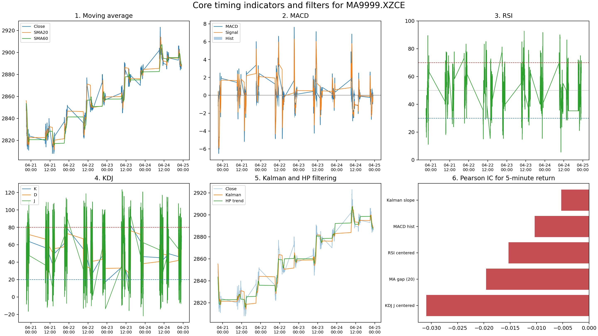

# 第六次作业：技术指标、滤波方法与时间序列预测

## 1. 本报告要解决的问题

择时策略解决的是什么时候买、什么时候卖的问题。对单个期货合约而言，择时的核心是判断当前价格对未来一段时间收益有没有提示作用。

本报告有六个核心方法：

| 类型 | 方法 | 用途 |
| --- | --- | --- |
| 技术指标 | 均线偏离 | 判断价格是否偏离近期中枢 |
| 技术指标 | MACD | 判断趋势是否增强或减弱 |
| 技术指标 | RSI | 判断近期上涨力量是否过强或过弱 |
| 技术指标 | KDJ | 判断价格在近期高低区间中的位置 |
| 滤波方法 | HP 滤波 | 提取较平滑的价格趋势 |
| 滤波方法 | Kalman 滤波 | 从带噪声的价格中估计隐藏趋势 |

## 2. 数据说明

数据来自 `hw6/future_data.zip` 中的 `future_data.pkl`。读取时使用 `pickle` 的 `rb` 模式。原始数据是 Python 字典，键为合约代码，值为该合约的分钟行情数据。

本报告选取 `MA9999.XZCE`，即郑商所甲醇主力连续合约。样本信息如下：

| 项目 | 内容 |
| --- | --- |
| 样本合约 | `MA9999.XZCE` |
| 数据频率 | 分钟 |
| 样本区间 | `2020-01-02 09:01:00` 至 `2026-04-24 23:00:00` |
| 非缺失收盘价数量 | `514920` |
| 使用字段 | `open`、`close`、`high`、`low`、`volume`、`money` |
| 主要预测目标 | 未来 `5` 分钟对数收益率 |
| 补充预测周期 | `15`、`30`、`60` 分钟 |

选择甲醇主力合约的原因是该合约分钟数据完整，成交活跃，适合观察短周期择时信号。

## 3. 方法解释

### 3.1 均线偏离

均线是过去一段时间价格的平均值。它的作用是降低价格噪声，得到一个短期中枢。本报告使用 20 分钟均线，并计算：

```text
均线偏离 = 当前价格 / 20分钟均线 - 1
```

如果价格明显高于均线，说明当前价格处在近期偏高位置；如果价格明显低于均线，说明当前价格处在近期偏低位置。该指标既可以用于趋势策略，也可以用于反转策略。本实验用数据检验哪一种解释更有效。

### 3.2 MACD

MACD 使用快慢两条指数移动平均线刻画趋势变化。快线反应短期价格，慢线反应较长期价格。快线高于慢线时，短期趋势强于长期趋势；快线低于慢线时，短期趋势弱于长期趋势。

本报告使用 `MACD hist` 作为预测信号。它表示 MACD 线与信号线之间的差距，用于衡量趋势正在增强还是减弱。

### 3.3 RSI

RSI 衡量近期上涨幅度在总波动中的占比。RSI 高，说明近期上涨力量较强；RSI 低，说明近期下跌力量较强。通常将 RSI 高位理解为超买，将 RSI 低位理解为超卖。

本报告使用中心化后的 RSI：

```text
RSI centered = (RSI - 50) / 50
```

这样处理后，正值表示偏强，负值表示偏弱。

### 3.4 KDJ

KDJ 衡量当前价格在近期最高价和最低价之间的位置。价格越接近近期高点，KDJ 越高；价格越接近近期低点，KDJ 越低。

本报告使用 `KDJ J centered` 作为信号。J 值比 K 值和 D 值更敏感，适合观察短周期价格是否处在极端位置。

### 3.5 HP 滤波

HP 滤波把价格拆成两部分：平滑趋势和短期波动。它通过惩罚趋势曲线的弯曲程度，使趋势线比原始价格更平滑。

HP 滤波适合观察趋势，但不适合直接作为实时交易信号。原因是 HP 滤波在计算当前趋势时会受到完整样本和端点处理影响。

### 3.6 Kalman 滤波

Kalman 滤波把价格理解为“真实趋势 + 观测噪声”。真实趋势不能直接看到，市场价格是带噪声的观测值。Kalman 滤波根据上一时刻的趋势估计和当前价格，递推更新当前趋势。

本报告使用 Kalman 滤波趋势的 5 分钟变化率作为预测信号：

```text
Kalman slope = Kalman趋势当前值 / Kalman趋势5分钟前的值 - 1
```

## 4. 图形结果

下图展示了五类核心技术指标和滤波方法，以及这些信号对未来 5 分钟收益率的 Pearson IC。



图中可以读出以下结果：

1. 均线和 Kalman 滤波都能让价格曲线更平滑，但在价格跳变时会滞后；
2. RSI 和 KDJ 反应更快，适合刻画短期超买和超卖；
3. HP 滤波曲线较平滑，适合观察趋势，不直接用于实时预测；
4. Pearson IC 图中所有信号的 IC 都为负，说明这些信号在样本内更适合按短期反转方向解释。

## 5. 预测结果

### 5.1 未来 5 分钟收益率

下表展示各信号对未来 5 分钟对数收益率的预测结果：

| 信号 | 类别 | Pearson IC | Spearman IC | 更优方向准确率 |
| --- | --- | ---: | ---: | ---: |
| KDJ J centered | 技术指标 | -0.0309 | -0.0660 | 0.5897 |
| MA gap (20) | 技术指标 | -0.0196 | -0.0589 | 0.5909 |
| RSI centered | 技术指标 | -0.0153 | -0.0484 | 0.5849 |
| MACD hist | 技术指标 | -0.0104 | -0.0386 | 0.5817 |
| Kalman slope | 滤波信号 | -0.0053 | -0.0236 | 0.5767 |

结果显示，5 分钟 horizon 下表现最强的是 `KDJ J centered`，Pearson IC 为 `-0.0309`。均线偏离和 RSI 排在其后。Kalman 滤波斜率的 IC 绝对值最小。

所有信号的 Pearson IC 均为负。该结果说明，在本样本中，价格短期偏强后更容易出现回落，价格短期偏弱后更容易出现修复。因此，短期反转解释优于趋势延续解释。

### 5.2 不同预测周期

不同预测周期下，绝对 IC 最大的信号如下：

| Horizon | 最强信号 | Pearson IC | 说明 |
| --- | --- | ---: | --- |
| 5 分钟 | KDJ J centered | -0.0309 | 短期区间位置最有效 |
| 15 分钟 | KDJ J centered | -0.0125 | 反转关系减弱 |
| 30 分钟 | MA gap (20) | -0.0100 | 均线偏离进入第一位 |
| 60 分钟 | MA gap (20) | -0.0094 | 预测关系继续减弱 |

预测周期越长，IC 绝对值整体越低。该结果说明，本样本中的可预测性主要集中在短周期价格偏离后的修正过程。

## 6. 技术指标和滤波方法的比较

### 6.1 技术指标的优点

技术指标的优点是简单、直观、容易解释。均线偏离说明价格离近期中枢有多远；RSI 和 KDJ 说明价格是否处在近期极端位置；MACD 说明趋势是否正在增强。

技术指标也容易转化为交易规则。例如，KDJ 过高时不追涨，KDJ 过低时观察反弹；价格偏离均线太远时，观察是否回到均线附近。

### 6.2 技术指标的局限

技术指标依赖参数。均线窗口、RSI 窗口、KDJ 窗口不同，结果会不同。技术指标也容易受到分钟级噪声影响，产生频繁信号。

同一个指标还需要确定使用方向。以均线偏离为例，价格高于均线可以解释为趋势强，也可以解释为短期过热。本实验结果支持第二种解释，即短期反转。

### 6.3 滤波方法的优点

滤波方法可以降低噪声，让价格趋势更清楚。HP 滤波适合观察长期趋势，Kalman 滤波适合递推估计隐藏趋势。

滤波方法的价值在于“整理价格信息”。它可以作为后续策略的输入，也可以帮助判断市场状态。

### 6.4 滤波方法的局限

滤波方法本身不是买卖规则。滤波曲线向上，不等于未来一定上涨；滤波曲线向下，也不等于未来一定下跌。必须再定义预测规则，才能形成择时策略。

此外，滤波会带来滞后。价格快速变化时，平滑曲线通常反应更慢。HP 滤波还存在实时使用问题，因此本报告只将 HP 滤波用于趋势展示，不将其纳入预测表。

## 7. 结论

本实验得到以下结论：

1. 在 `MA9999.XZCE` 分钟数据中，KDJ、均线偏离和 RSI 的短周期预测效果相对较好；
2. 这些信号与未来 5 分钟收益率呈负相关，说明样本内短期反转强于趋势延续；
3. Kalman 滤波能降低价格噪声，但单独使用 Kalman 斜率进行短周期预测，效果弱于核心技术指标；
4. HP 滤波适合展示趋势，不适合直接作为实时交易信号；
5. 单一指标的 IC 绝对值不高，实际策略还需要加入交易成本、样本外检验和仓位控制。

## 8. 读书报告

Hollstein、Prokopczuk、Tharann 和 Wese Simen 研究商品市场收益和波动率的可预测性。文章使用 1871 年 1 月至 2015 年 12 月的月度现货数据，覆盖 30 个商品和 16 个商业周期变量，用滞后变量预测未来 1 个月商品超额收益，并用类似框架预测波动率，同时比较衍生品引入前后的变化。

文章结论比较清楚。第一，工业生产增长和通货膨胀是商品未来收益最强的预测变量，样本内和样本外表现都较好。第二，收益预测和波动率预测不是同一件事；有些变量对收益帮助有限，但能改善波动率预测，组合预测也更稳。第三，期货等衍生品引入后，大型活跃商品市场的收益可预测性通常下降，反映市场效率提高；部分商品的可预测性上升，作者将其解释为价格发现向衍生品市场转移。

这篇文章对本实验的启发是：商品价格确实含有可预测信息，但有效信号不应只依赖分钟级技术指标。本实验中 KDJ、均线偏离和 RSI 对未来 5 分钟收益有弱反转关系，但 IC 绝对值较低。更完整的商品择时研究应加入宏观变量、期限结构、成交量、波动率、交易成本和样本外检验。

参考文献：Fabian Hollstein, Marcel Prokopczuk, Björn Tharann, Chardin Wese Simen, Predictability in commodity markets: Evidence from more than a century, Journal of Commodity Markets, Volume 24, 2021, 100171. 作者接受稿：https://centaur.reading.ac.uk/95509/1/Draft_Commodity.pdf

## 9. 文件说明

| 文件 | 作用 |
| --- | --- |
| `run_hw6.py` | 实验入口 |
| `src/hw6_analysis/data.py` | 数据读取和样本信息 |
| `src/hw6_analysis/indicators.py` | 技术指标计算 |
| `src/hw6_analysis/filters.py` | 滤波方法计算 |
| `src/hw6_analysis/evaluation.py` | 预测评价计算 |
| `src/hw6_analysis/plots.py` | 汇总图绘制 |
| `outputs/tables/*.csv` | 实验结果表 |
