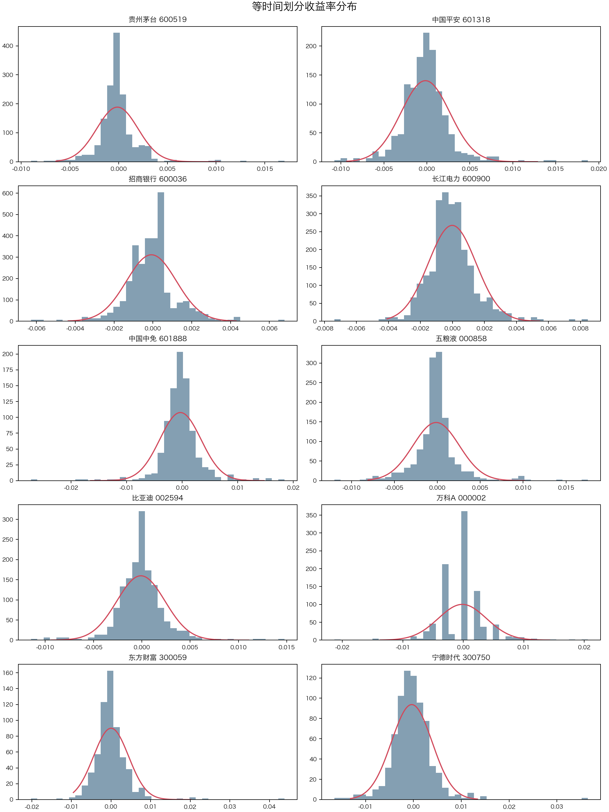
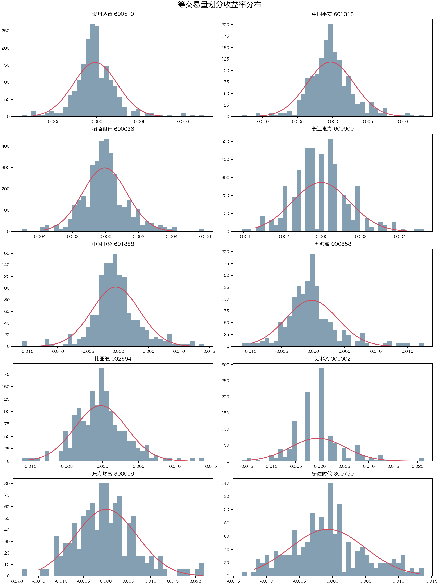
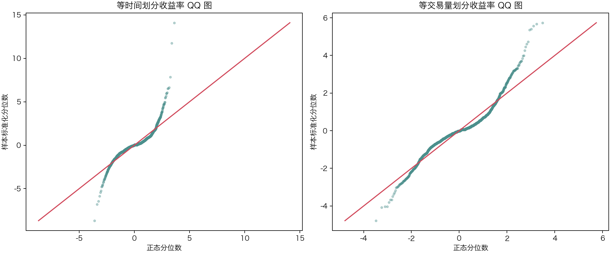
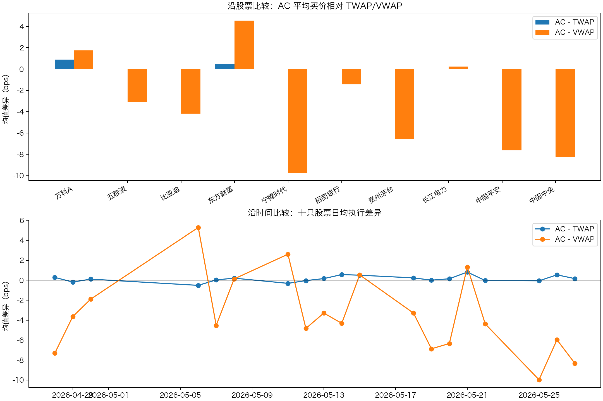
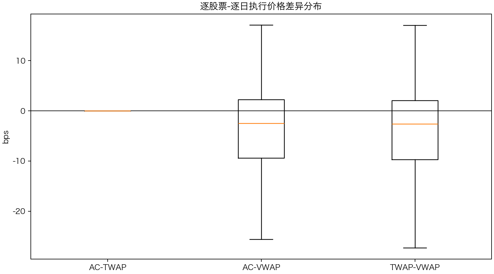

# 第9次作业（个人作业）第一题：高频数据特征和交易

## 一、数据与参数设定

本文选取十只流动性较好的 A 股作为样本：贵州茅台(600519)、中国平安(601318)、招商银行(600036)、长江电力(600900)、中国中免(601888)、五粮液(000858)、比亚迪(002594)、万科A(000002)、东方财富(300059)、宁德时代(300750)。分钟行情来自 Yahoo Finance chart API，样本区间为 2026-04-28 至 2026-05-27，共 19 个交易日。公开接口在一个月窗口下返回的是 2 分钟频率价量数据；这仍属于分钟级高频数据，但不是逐笔或严格 1 分钟数据。字段包括分钟开盘价、收盘价、最高价、最低价和成交量；成交量换算为“手”。为避免非连续交易时段干扰，仅保留 09:30-11:30 与 13:00-15:00 的正常连续竞价分钟。

收益率统一使用对数收益率：

$$r_{i,t}=\ln(P_{i,t,\mathrm{end}})-\ln(P_{i,t,\mathrm{start}}).$$

等时间划分采用 10 分钟一段；等交易量划分采用“每只股票样本期日成交量中位数的 1/20”作为目标成交量阈值，因此每只股票每天大致形成 20 个成交量片段。

## 二、习题（1）：等时间与等交易量收益率分布

### （a）等时间间隔划分

等时间划分下，每个交易日被切成固定长度的 10 分钟片段。图 1 给出了各股票收益率直方图及同均值、同标准差正态密度曲线。整体看，分钟收益率并不服从正态分布：尖峰、厚尾十分明显，收益率质量集中在 0 附近，但极端正负收益出现频率高于正态假设。

统计检验结果也支持这一结论。10 只股票中，Jarque-Bera 检验在 5% 显著性水平下拒绝正态性的股票数为 10/10；平均超额峰度为 10.49。这说明等时间收益率普遍存在肥尾和非零偏度。

### （b）等交易量划分

等交易量划分把时间轴改成“交易量时钟”：成交活跃时片段较短，成交清淡时片段较长。图 2 为等交易量收益率直方图及正态密度曲线。相较于等时间划分，等交易量收益率的波动尺度更接近同一量级，但正态性仍然较弱。

在统计检验上，Jarque-Bera 检验拒绝正态性的股票数为 9/10；平均超额峰度为 1.99。QQ 图进一步显示，两类划分的尾部都偏离 45 度线，说明极端收益仍比正态分布更多。

### （c）两种划分方式比较

两种划分的主要区别如下。

1. 等时间划分反映的是自然时间中的价格变化，因此开盘、收盘等成交密集时段的收益率波动更大，午间前后或盘中清淡时段波动较小。
2. 等交易量划分把每段成交量控制在接近水平，降低了成交活跃度日内季节性对收益率分布的影响。样本中等交易量收益率标准差与等时间收益率标准差的平均比值为 1.271。
3. 等交易量划分不能消除厚尾。信息冲击、价格跳跃、买卖盘不平衡等因素仍会造成收益率分布偏离正态。

从本样本看，等交易量划分更适合研究“每单位交易量对应的价格变化”，而等时间划分更适合描述交易者在真实钟表时间下面临的波动风险。

## 三、习题（2）：Almgren-Chriss 模型下的买入执行

设交易者对每只股票、每个交易日均希望买入 $X=100$ 手，即 10,000 股。由于数据频率为 2 分钟，本文在可观测频率上离散化下单，即每隔 2 分钟下一次单。本文采用离散 Almgren-Chriss 型目标函数：

$$\min_{n_j}\sum_j \gamma n_j^2 + \lambda\sigma^2\tau\sum_j x_j^2,$$

其中 $n_j$ 为第 $j$ 个分钟级区间买入股数，$x_j$ 为尚未完成的剩余股数，$\lambda=1.0e-06$ 为风险厌恶系数，$\tau=2/240$ 个交易日，$\sigma$ 使用样本内该股票 2 分钟对数收益率标准差估计。冲击参数 $\gamma$ 按流动性设定为“若一次买入约 10% 日成交量，将产生约 10% 当日中位价格的临时冲击”的线性系数，即 $\gamma=0.1P/ADV$。

最优交易轨迹写成：

$$x_j=X\frac{\sinh(\kappa(N-j))}{\sinh(\kappa N)},\quad n_j=x_{j-1}-x_j.$$

计算得到的 AC 平均买价按“实际分钟价格 + 线性临时冲击”加权。沿股票比较，AC 平均买价相对 TWAP 的平均差异为 0.14 bps，相对 VWAP 的平均差异为 -3.43 bps。逐日逐股票看，AC 低于 TWAP 的比例为 28.9%，低于 VWAP 的比例为 62.1%。

沿时间比较可以看到，当样本日十只股票平均日内收益率为正时，AC 由于略微前置下单，通常相对 TWAP 更有优势；当价格全天下跌时，前置买入反而会提高平均买价。沿股票比较上，流动性较好、价格趋势较弱的股票，三种执行方式差异较小；日内趋势明显或成交量分布高度不均匀的股票，AC、TWAP、VWAP 差异更明显。

## 四、习题（3）：TWAP、VWAP 与 AC 结果比较

TWAP 定义为分钟价格的简单平均买价；VWAP 定义为按市场分钟成交量加权的平均买价；AC 则根据风险厌恶与冲击成本在全天动态分配订单。三者对比如下：

本样本中，TWAP 相对 VWAP 的平均差异为 -3.56 bps。AC 是否优于 TWAP/VWAP 并非固定结论，而取决于价格路径、成交量分布和参数设定：

1. 若日内价格上升，前置执行的 AC 倾向于降低买入成本，可能优于 TWAP/VWAP。
2. 若日内价格下降，AC 的前置执行会更早买入，通常不如更均匀的 TWAP 或随成交量执行的 VWAP。
3. 若提高 $\lambda$，交易者更厌恶未成交头寸风险，AC 会进一步前置；若提高 $\gamma$，冲击成本更高，AC 会更接近 TWAP。
4. VWAP 在成交量分布稳定、交易者希望贴近市场成交结构时更自然；TWAP 实施简单，但不考虑日内成交量差异。

因此，习题（2）中的 AC 下单方式不能笼统说“优于”TWAP 与 VWAP。它在模型假设成立、风险厌恶和冲击参数与真实市场匹配时更优；但若参数设定不准或日内价格趋势与前置执行方向相反，AC 的实现买价可能高于 TWAP/VWAP。

## 五、主要输出文件

- `../outputs/tables/normality_equal_time.csv`：等时间收益率正态性统计。
- `../outputs/tables/normality_equal_volume.csv`：等交易量收益率正态性统计。
- `../outputs/tables/partition_comparison.csv`：两种划分方式对比。
- `../outputs/tables/ac_daily_results.csv`：每只股票、每个交易日的 AC/TWAP/VWAP 平均买价。
- `../outputs/tables/ac_summary_by_stock.csv`：沿股票汇总。
- `../outputs/tables/ac_summary_by_date.csv`：沿时间汇总。
- `../outputs/tables/method_comparison.csv`：三种执行方法相对市场 VWAP 的汇总。
